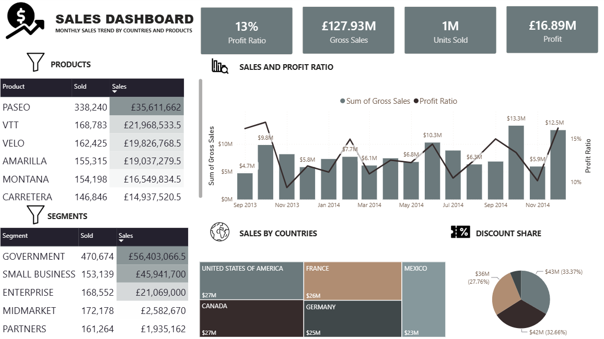

# Power BI Sales Performance Dashboard

## Project Overview

This project presents an interactive Power BI dashboard designed to analyse sales performance across products, customer segments, countries and discount bands.

The dashboard provides executives and sales managers with a clear overview of gross sales, profit, units sold and profitability trends.



## Business Objectives

The dashboard was created to answer the following business questions:

- What is the total sales and profit performance?
- Which products generate the highest revenue?
- Which customer segments contribute the most sales?
- Which countries are the strongest markets?
- How do gross sales and profit ratio change over time?
- What proportion of sales is associated with each discount band?

## Key Performance Indicators

The dashboard contains the following KPIs:

- Gross Sales
- Total Profit
- Units Sold
- Profit Ratio

## Dashboard Features

- Product performance analysis
- Customer segment analysis
- Sales by country
- Monthly sales trend
- Profit ratio analysis
- Discount band distribution
- Interactive filtering by product and segment

## Dataset

The dataset contains 700 sales records.

Main columns include:

- Date
- Segment
- Country
- Product
- Discount Band
- Units Sold
- Gross Sales
- Discounts
- Profit

## Data Preparation

The data was prepared in Power Query.

The main preparation steps included:

- Checking data types
- Formatting date columns
- Formatting currency and numeric fields
- Checking for missing values
- Creating calculated fields
- Preparing the dataset for reporting

## DAX Measures

Example measures used in the project:

```DAX
Total Gross Sales =
SUM(financials[Gross Sales])
